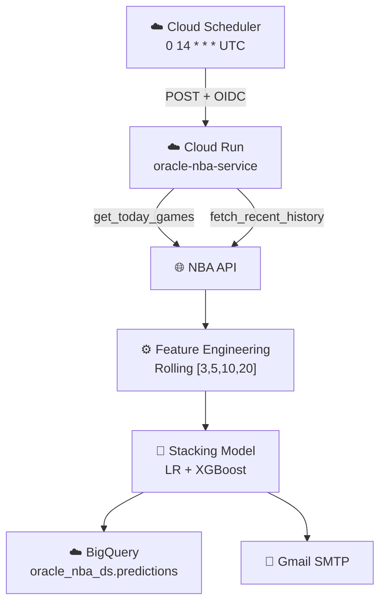
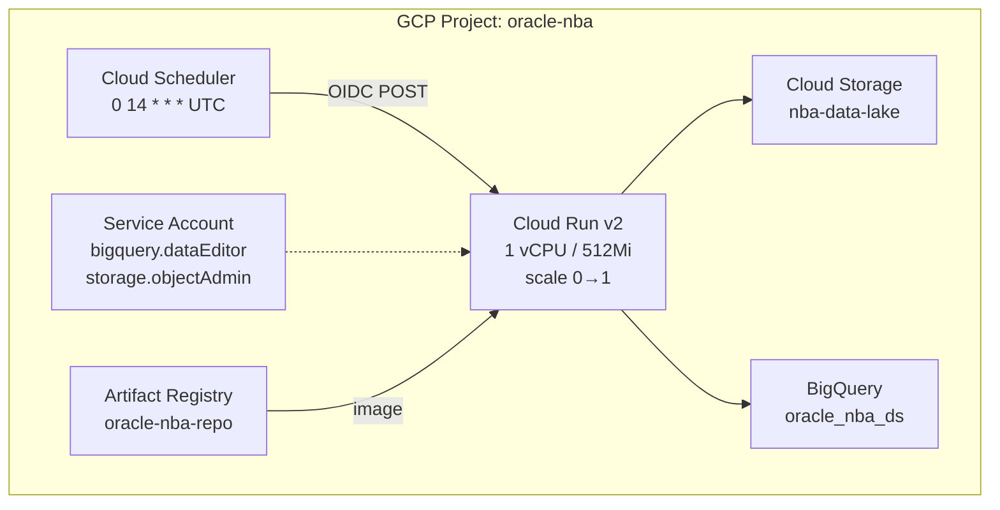

# ARCHITECTURE.md — Oráculo NBA

> Última actualización: 2026-03-23 | Versión: 3.2.0

---

## 1. Visión del Sistema

El **Oráculo NBA** es un sistema de predicción de apuestas de valor (*Value Betting*) que:

1. Extrae datos en tiempo real de la NBA API.
2. Genera features de tendencia por equipo (rolling windows + días de descanso).
3. Aplica un Stacking Ensemble (Logistic Regression + XGBoost) para predecir la probabilidad de victoria local.
4. Recomienda apuestas donde la probabilidad supera el break-even matemático de las odds 1.91.
5. Persiste en BigQuery y notifica por email.

---

## 2. Flujo de Datos Principal



Ver diagramas completos en [docs/architecture/flow-diagram.md](docs/architecture/flow-diagram.md).

---

## 3. Módulos del Sistema

### 3.1 Capa de Datos (`src/data/`)

| Módulo | Clase | Responsabilidad |
|--------|-------|----------------|
| `ingestion.py` | `NBADataIngestor` | Extrae partidos de la NBA API por temporada. Guarda en Parquet local y opcionalmente en GCS. |
| `feature_engineering.py` | `NBAFeatureEngineer` | Rolling averages [3,5,10,20] con `shift(1)` anti-leakage. Estructura 1 fila/partido con prefijos HOME_/AWAY_. |
| `eda_report.py` | `run_eda()` | Análisis de correlación entre estadísticas y victoria. Genera `data/processed/eda_report.txt`. |

### 3.2 Capa de Modelos (`src/models/`)

| Módulo | Clase | Responsabilidad |
|--------|-------|----------------|
| `trainer.py` | `NBAModelTrainer` | Entrena LR y XGBoost con split temporal 80/20. Registra en MLflow. |
| `tuner.py` | `NBAHyperTuner` | Optimización Bayesiana de XGBoost con Optuna (20 trials, minimize log_loss). |
| `stacking_trainer.py` | `NBAStackingTrainer` | Meta-modelo StackingClassifier con CV=5. **Genera el modelo de producción.** |
| `evaluator.py` | `NBAProfitSim` | Simula estrategia de apuestas de unidad fija. Calcula ROI, win rate y profit. |
| `inference.py` | `NBAOracleInference` | Pipeline de predicción diaria. Carga el stacking model y orquesta el flujo completo. |

### 3.3 Capa de Utilidades (`src/utils/`)

| Módulo | Clase | Responsabilidad |
|--------|-------|----------------|
| `bigquery_client.py` | `NBABigQueryClient` | Inserta predicciones en `oracle_nba_ds.predictions`. Degrada elegantemente sin GCP_PROJECT_ID. |
| `email_service.py` | `NBAEmailService` | Envía reportes HTML y alertas de error vía Gmail SMTP (TLS, puerto 587). |
| `report_generator.py` | `NBAReportGenerator` | Genera tabla HTML estilizada con recomendaciones color-coded. |
| `logger.py` | `setup_logger()` | Logger centralizado con formato `timestamp - oracle-nba - LEVEL - message`. |

---

## 4. Modelo de Datos

### 4.1 BigQuery — `oracle_nba_ds.predictions`

| Campo | Tipo | Modo | Descripción |
|-------|------|------|-------------|
| `game_id` | STRING | REQUIRED | ID único del partido (NBA API) |
| `game_date` | DATE | REQUIRED | Fecha del partido |
| `home_team_id` | INTEGER | REQUIRED | ID equipo local |
| `away_team_id` | INTEGER | REQUIRED | ID equipo visitante |
| `prob_home_win` | FLOAT64 | REQUIRED | Probabilidad local (0–1) |
| `recommendation` | STRING | REQUIRED | HOME / AWAY / SKIP |
| `model_version` | STRING | NULLABLE | ej. `stacking_v1` |
| `experiment_id` | STRING | NULLABLE | MLflow run ID |
| `timestamp` | TIMESTAMP | REQUIRED | Momento de inserción |

### 4.2 Features del Modelo (`data/processed/nba_games_features.parquet`)

Para cada ventana `w ∈ [3, 5, 10, 20]` y cada stat `s ∈ [PTS, FG_PCT, FG3_PCT, FT_PCT, AST, REB, TOV, PLUS_MINUS]`:

- `HOME_ROLL_{s}_{w}` — Promedio móvil del equipo local (ventana w, con shift(1))
- `AWAY_ROLL_{s}_{w}` — Promedio móvil del equipo visitante
- `HOME_DAYS_REST` — Días de descanso del local (capped en 10)
- `AWAY_DAYS_REST` — Días de descanso del visitante
- `TARGET` — 1 si ganó el local, 0 si ganó el visitante

**Total de features:** 2 × 8 stats × 4 ventanas + 2 rest days = **66 features**

---

## 5. Lógica de Recomendación

Con odds de mercado estándar **1.91** (-110 americano):

```
Break-even = 1 / 1.91 = 52.36%

Umbrales aplicados:
  HOME : prob_home_win > 0.524
  AWAY : prob_home_win < 0.476
  SKIP : 0.476 ≤ prob_home_win ≤ 0.524

Cálculo de ganancia (unidad = $100):
  Acierto : +$91.00   (100 × (1.91 - 1))
  Fallo   : -$100.00
```

---

## 6. Infraestructura GCP



Ver manual completo en [docs/infrastructure/gcp-setup.md](docs/infrastructure/gcp-setup.md).

---

## 7. CI/CD (GitHub Actions)

**Archivo:** `.github/workflows/deploy.yml` | **Trigger:** Push a rama `main`

| Job | Acción | Bloqueante |
|-----|--------|-----------|
| `test` | `pytest tests/` | Sí — fallo detiene el despliegue |
| `deploy` | `docker build` + `gcloud run deploy` | Depende de `test` |

**Secrets requeridos:** `GCP_SA_KEY`, `GCP_PROJECT_ID`, `GMAIL_USER`, `GMAIL_APP_PASSWORD`

---

## 8. Manejo de Errores y Resiliencia

- **NBA API:** 5 reintentos con backoff exponencial (`urllib3.util.retry.Retry`).
- **Inferencia:** Imputación cascada de NaN: `ROLL_x_20 ← ROLL_x_10 ← ROLL_x_5 ← ROLL_x_3 ← 0`.
- **BigQuery:** Retorna `False` sin crash si `GCP_PROJECT_ID` no está configurado.
- **Email:** Captura excepción SMTP y loguea sin propagar.
- **Global:** `main.py` envuelve todo el pipeline en `try/except` y activa `send_error_alert()` con el traceback completo.

---

## 9. Decisiones de Diseño (ADRs)

### ADR-1: Stacking Ensemble como modelo de producción
**Decisión:** Usar StackingClassifier (LR + XGBoost) en lugar de un solo modelo.
**Razón:** El ensemble combinó las fortalezas del LR (estabilidad, calibración) con XGBoost (captura no lineal). ROI subió de 22.2% (XGBoost solo) a **24.29%**.

### ADR-2: Split temporal 80/20 (no aleatorio)
**Decisión:** Ordenar cronológicamente y tomar el 20% final como test set.
**Razón:** Simula el escenario real. Un split aleatorio introduciría data leakage temporal.

### ADR-3: `shift(1)` antes del rolling
**Decisión:** Calcular rolling windows sobre datos desplazados en 1 posición.
**Razón:** Evita que el resultado del partido actual influya en su propio predictor.

### ADR-4: Flask en lugar de FastAPI
**Decisión:** Usar Flask como framework web.
**Razón:** Un único endpoint sin validación de schemas de entrada. Flask minimiza complejidad para este caso de uso.

### ADR-5: Imputación cascada de NaN
**Decisión:** `ROLL_x_20 ← ROLL_x_10 ← ROLL_x_5 ← ROLL_x_3 ← 0`.
**Razón:** Equipos con pocos partidos no tienen ventanas largas. La cascada garantiza siempre un valor usando la mejor estimación disponible.
