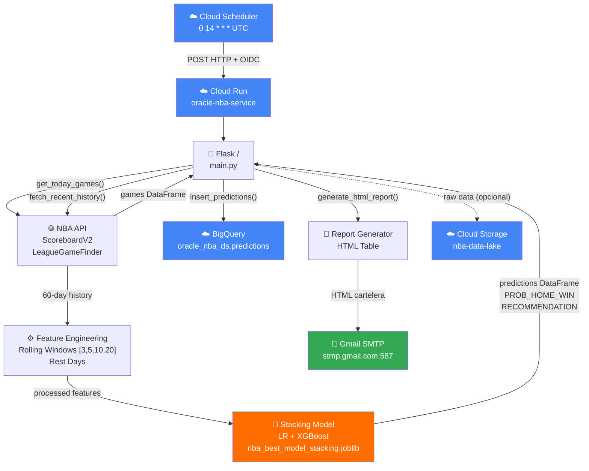
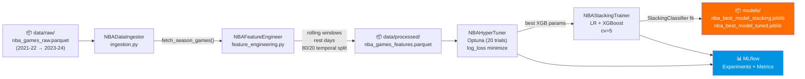
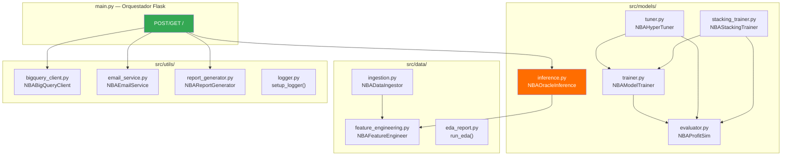
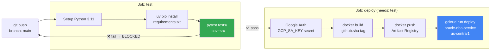
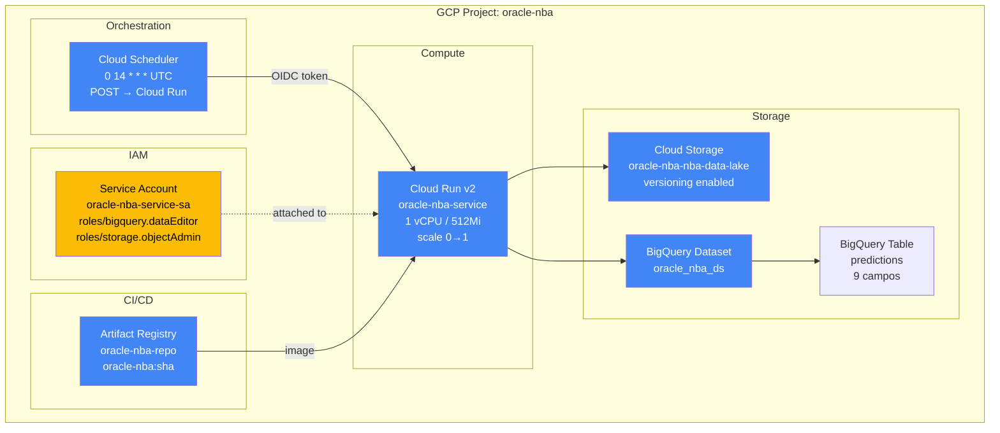
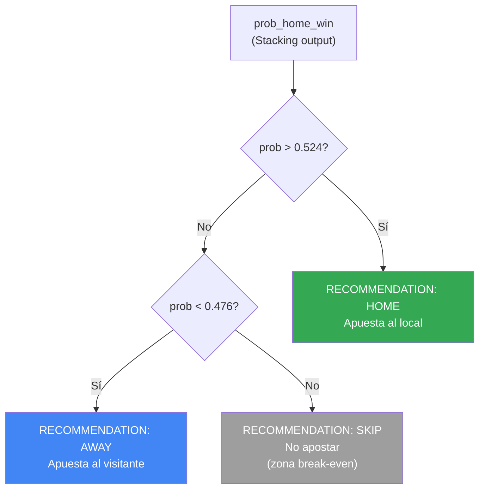

# Diagramas de Arquitectura — Oráculo NBA

> Generado por `/technical-writer` | 2026-03-23

---

## 1. Flujo de Datos Principal (End-to-End)

---

## 2. Pipeline de ML (Entrenamiento)

---

## 3. Arquitectura de Módulos Python

---

## 4. Pipeline de CI/CD (GitHub Actions)

---

## 5. Infraestructura GCP (Terraform)

---

## 6. Lógica de Recomendación de Apuesta

> **Justificación de umbrales:** Con odds 1.91 (-110 americano), el break-even es 1/1.91 = 52.36%. Se usa ±2.4% como margen de seguridad → [47.6%, 52.4%].
